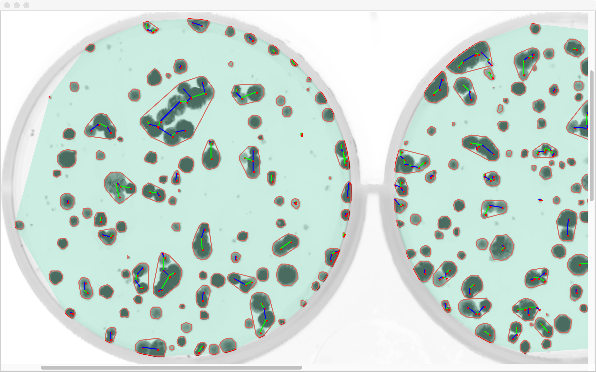
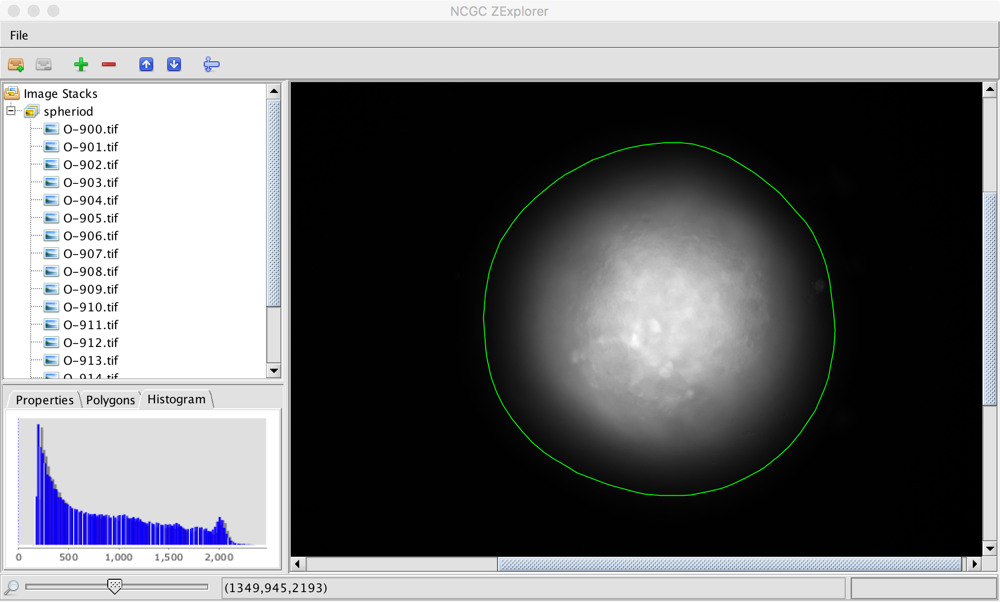
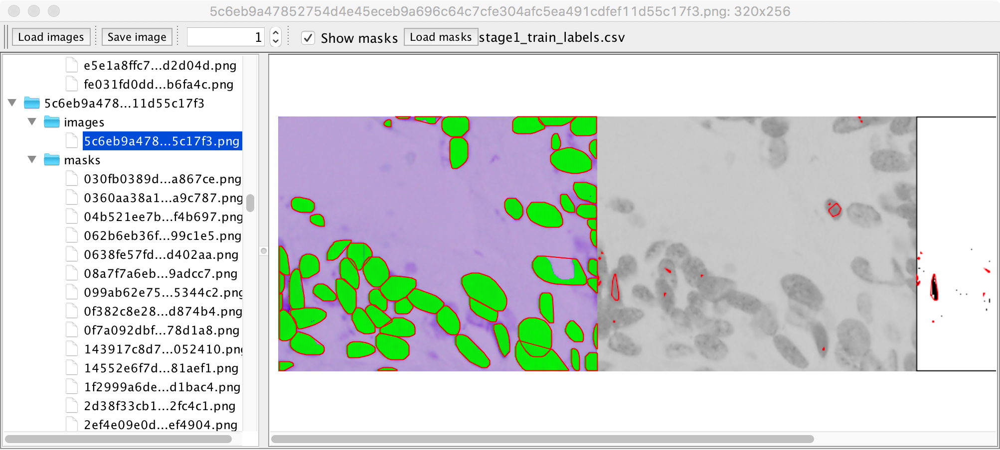

Cell Colony Analysis
====================

This repository contains various image processing algorithms for
analyzing cell colonies.

Example of colony cell segementation:

Example of spheroid segmentation image stack:

Nuclei Viewer
=============

A simple viewer to browse nuclei segmentation from Kaggle's 2018
data science bowl: https://www.kaggle.com/c/data-science-bowl-2018

